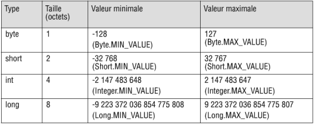
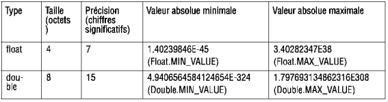
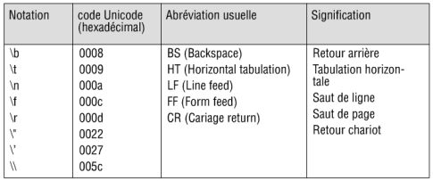

*************
Types en Java
*************

Types Primitifs
***************

4 types primitfs en Java:

* les entiers
* les flottants
* les caracteres
* les booleans
   
Les entiers
+++++++++++

Les flottants
+++++++++++++

Les caractéres
++++++++++++++

mot clef: **char** .

Java représente les caracteres en memoires sur 2 octets.

On peut aussi obtenir leur valeur en int 

.. code-block:: java

    char c = 'E';
    char a = 65;
    System.out.Println(" a = "+ a); 
    // affichera a = A

ci dessous, les charactéres ne disposant pas de graphisme :

Les booleans
++++++++++++

Ils sont notés soit *true* ou *false*

Constante de Type Primitifs
+++++++++++++++++++++++++++

En java on utilise le mot clef : **final**

Il est d'*usage* d'ecrire le nom de la constante en **majuscule**

Et on peut l'intialiser en différé soit un peu aprés sa déclaration. 

Donc **final** différe quelque peu de la notion de constante symbolique: 

pour résumer en Java, **final** permet de déclarer que la variable aura une valeur fixe et immuable une fois son initialisation effectuée

.. code-block:: java

    final int N =20;
    // permet d'ulitser la constante a partir d'un Object et non d'instance 
    //et ceci partout puisqu'elle est déclarée en public static
    public static final int N =20;

